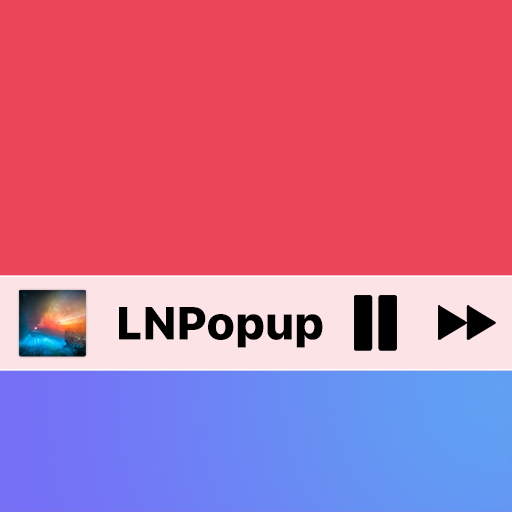
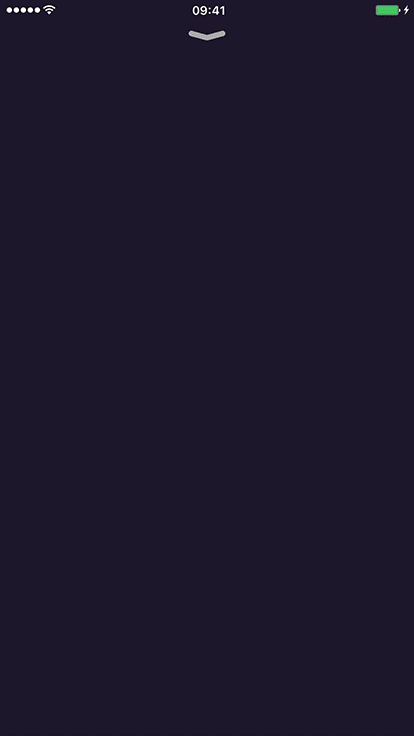
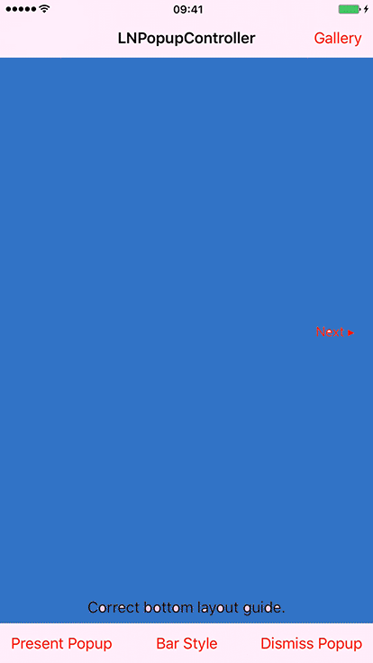
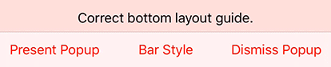

#LNPopupController



`LNPopupController` is a framework for presenting view controllers as popups of other view controllers, much like the Apple Music and Podcasts apps.

[](https://github.com/LeoNatan/LNPopupController/releases) <span class="badge-paypal"><a href="https://www.paypal.com/cgi-bin/webscr?cmd=_s-xclick&hosted_button_id=BR68NJEJXGWL6" title="Donate to this project using PayPal"></a></span>

[](https://github.com/LeoNatan/LNPopupController/stargazers) [](https://raw.githubusercontent.com/LeoNatan/LNPopupController/master/LICENSE) [](https://github.com/Carthage/Carthage)

[](https://github.com/LeoNatan/LNPopupController/issues) [](https://github.com/LeoNatan/LNPopupController/issues?q=is%3Aissue+is%3Aclosed) [](https://github.com/LeoNatan/LNPopupController/graphs/contributors)

 

 

See a video of the modern popup look & feel [here](https://vimeo.com/194064291) and a video of the classic popup look & feel [here](https://vimeo.com/137020302).

Once a popup bar is presented with a content view controller, the user can swipe or tap the popup at any point to present the content controller. After finishing, the user dismisses the popup by either swiping or tapping the popup close button.

The framework is intended to be very generic and work in most situations, so it is implemented as a category over `UIViewController`. Each view controller can present a popup bar, docked to a bottom view. 
For `UITabBarController` subclasses, the default dock view is the tab bar. 
For `UINavigationController` subclasses, the default dock view is the toolbar.
For other classes, the popup bar is presented at the bottom of the screen. View controller subclasses can provide their own docking views.

The framework attempts to correct the top and bottom layout guides of the container controller and its child controllers as the popup bar is presented and dismissed.

The contents of the popup bar is built dynamically using the popup item objects (instances of the `LNPopupItem` class) associated with the popup content view controllers. To change the contents of the popup bar, you must therefore configure the popup items of your view controllers.

Generally, it is recommended to present the popup bar on the outermost container controller. So if you have a view controller container in a navigation controller, which is in turn contained in a tab bar controller, it is recommended to present the popup bar on the tab bar controller.

Check the demo project for many common use cases of the framework in various scenarios. It contains examples in Swift and Objective C.

###Features

* Available for iOS 8 and above<sup>1</sup>, available as an Xcode dynamic framework
* Good citizen in modern UIKit world
* Modern Objective C syntax for best Swift interoperability

<sup>1</sup> The framework is available for iOS 8 and above. **The included demo project has a deployment target of iOS 9 and above**, and may crash with certain features enabled on iOS 8 simulator or devices.

##Adding to Your Project

###Carthage

Add the following to your Cartfile:

```github "LeoNatan/LNPopupController"```

###Manual

Drag the `LNPopupController.xcodeproj` project to your project, and add `LNPopupController.framework` to **Embedded Binaries** in your project target's **General** tab. Xcode should sort everything else on its own.

##Using the Framework

###Swift

While the framework is written in Objective C, it uses modern Objective C syntax, so using the framework in Swift should be very easy and intuitive.

###Project Integration

Import the module in your project:

```objective-c
@import LNPopupController;
```

###CocoaPods

CocoaPods is not supported. There are many reasons for this. Instead of CocoaPods, use Carthage. You can continue using CocoaPods for for your other dependencies and Carthage for `LNPopupController`.

###Popup Items

A popup item always reflects information about the view controller with which it is associated. The popup item should provide a title and subtitles to display when the view controller is the content controller of a popup bar. In addition, the item may contain additional buttons to display on the left and right side of the popup bar using `leftBarButtonItems` and `rightBarButtonItems`.

###Managing the Popup Bar

To present the popup bar, create a content controller, update its popup item and present the popup bar.

```objective-c
DemoPopupContentViewController* demoVC = [DemoPopupContentViewController new];
demoVC.view.backgroundColor = [UIColor redColor];
demoVC.popupItem.title = @"Hello World";
demoVC.popupItem.subtitle = @"And a subtitle!";
demoVC.popupItem.progress = 0.34;
	
[self.tabBarController presentPopupBarWithContentViewController:demoVC animated:YES completion:nil];
```

You can present a new content controller while the popup bar is presented and when the popup itself is open.

To open and close the popup programatically, use `openPopupAnimated:completion:` and `closePopupAnimated:completion:` respectively.

```objective-c
[self.tabBarController openPopupAnimated:YES completion:nil];
```

Alternatively, you can present the popup bar and open the popup in one animation, using `presentPopupBarWithContentViewController:openPopup:animated:completion:`.

```objective-c
[self.tabBarController presentPopupBarWithContentViewController:demoVC openPopup:YES animated:YES completion:nil];
```

To dismiss the popup bar, use `dismissPopupBarAnimated:completion:`.

```objective-c
[self.tabBarController dismissPopupBarAnimated:YES completion:nil];
```

If the popup is open when dismissing the popup bar, the popup content will also be dismissed.

###Popup Container View Controllers

Any `UIViewController` subclasses can be popup container view controllers. The popup bar is attached to a bottom docking view. By default, `UITabBarController` and `UINavigationController` subclasses return their bottom bars as docking view, while other controllers return a hidden 0pt height view on the bottom of the view. In your subclass, override `bottomDockingViewForPopup` and `defaultFrameForBottomDockingView` and return your view and frame accordingly. **The returned view must be attached to the bottom of the view controller's view, or results are undefined.**

```objective-c
- (nonnull UIView *)bottomDockingViewForPopup
{
	return self.myCoolBottomView;
}

- (CGRect)defaultFrameForBottomDockingView
{
	CGRect bottomViewFrame = self.myCoolBottomView.frame;
	
	if(self.isMyCoolBottomViewHidden)
	{
		bottomViewFrame.origin = CGPointMake(bottomViewFrame.origin.x, self.view.bounds.size.height);
	}
	else
	{
		bottomViewFrame.origin = CGPointMake(bottomViewFrame.origin.x, self.view.bounds.size.height - bottomViewFrame.size.height);
	}
	
	return bottomViewFrame;
}
``` 

###Appearance and Behavior

####Modern Look and Feel

`LNPopupController` provides two distinct style of popup look and feel, one based on iOS 10 Music app look and feel, and one based on iOS 9 look and feel. Popup bar styles are arbitrarily labeled "prominent" for iOS 10 style popup bar and "compact" for iOS 9 style. Popup interaction styles are labeled "snap" for iOS 10 style snapping popups and "drag" for iOS 9 interactive popup interaction. Popup close buttons styles are labeled "chevron" for iOS 10 style chevron close button and "round" for iOS 9 style close buttons. For each, there is a "default" style for choosing the most suitable one for the current operating system version.

The defaults for iOS 10 are:
* Prominent bar style
* Snap interaction style
* Chevron close button style

The defaults for iOS 9 are:
* Compact bar style
* Drag interaction style
* Round close button style

Customizing the popup bar style is achieved by setting the popup bar's `barStyle` property.

```swift
navigationController.popupBar.barStyle = .compact
```

Customizing the popup interaction style is achieved by setting the popup presentation containing controller's `popupInteractionStyle` property.

```swift
navigationController.popupInteractionStyle = .drag
```

Customizing the popup close button style is achieved by setting the popup content view's `popupCloseButtonStyle` property.

```swift
navigationController.popupContentView.popupCloseButtonStyle = .round
```

To disable the popup close button, set the `popupCloseButtonStyle` to `LNPopupCloseButtonStyleNone` / `.none`.

####Popup Bar Appearance

For navigation and tab bar controller popup containers, the style of the popup bar is determined according to the bottom bar's appearance. For other container controllers, the style is the default style. For each style, title and button colors will be adjusted accordingly.

To update the popup bar appearance after updating the appearance of the bottom bar of the container controller, use the `updatePopupBarAppearance` method.

 

Supplying long text for the title and/or subtitle will result in a scrolling text. Otherwise, the text will be centered.

 

The `hidesBottomBarWhenPushed` property is supported for navigation and tab bar controllers. When set, the popup bar will transition out together with the bottom bar of the container controller. **Opening the popup while it is hidden due to `hidesBottomBarWhenPushed` is not supported and may produce undefined behavior.**

 

Status bar management of the popup content view controller is respected and applied when appropriate.

 

###Customization

Customization can be achieved through the ```LNPopupBar``` and ```LNPopupContentView``` classes.

####Popup Bar Customization

```LNPopupBar``` exposes API to customize the popup bar's appearance, either through `UIAppearance` API or directly to popup bar objects.

```objective-c
[[LNPopupBar appearanceWhenContainedInInstancesOfClasses:@[[UINavigationController class]]] setTitleTextAttributes:@{NSFontAttributeName: [UIFont fontWithName:@"Chalkduster" size:14], NSForegroundColorAttributeName: [UIColor yellowColor]}];
[[LNPopupBar appearanceWhenContainedInInstancesOfClasses:@[[UINavigationController class]]] setSubtitleTextAttributes:@{NSFontAttributeName: [UIFont fontWithName:@"Chalkduster" size:12], NSForegroundColorAttributeName: [UIColor greenColor]}];
[[LNPopupBar appearanceWhenContainedInInstancesOfClasses:@[[UINavigationController class]]] setBarStyle:UIBarStyleBlack];
[[LNPopupBar appearanceWhenContainedInInstancesOfClasses:@[[UINavigationController class]]] setTintColor:[UIColor yellowColor]];
```

 

####Popup Content View and Gesture Customization

```LNPopupContentView``` exposes access to the popup close button and the popup interaction gesture recognizer.

**Note:** Modify the popup interaction gesture recognizer with care. It is shared between opening the popup content, by panning the popup bar up (when the popup bar is closed), and closing the popup content, by panning the popup content view (when the popup bar is open). If you disable the gesture recognizer after opening the popup, you must monitor the state of the popup and reenable the gesture recognizer once closed by the user or through code.

###Accessibility

The framework supports accessibility and will honor accessibility labels, hints and values. By default, the accessibility label of the popup bar is the title and subtitle provided by the popup item.


To modify the accessibility label and hint of the popup bar, set the `accessibilityLabel` and `accessibilityHint` properties of the `LNPopupItem` object of the popup content view controller.

```objc
demoVC.popupItem.accessibilityLabel = NSLocalizedString(@"Custom popup bar accessibility label", @"");
demoVC.popupItem.accessibilityHint = NSLocalizedString(@"Custom popup bar accessibility hint", @"");
```

To add accessibility labels and hints to buttons, set the `accessibilityLabel` and `accessibilityHint` properties of the `UIBarButtonItem` objects.

```objc
UIBarButtonItem* upNext = [[UIBarButtonItem alloc] initWithImage:[UIImage imageNamed:@"next"] style:UIBarButtonItemStylePlain target:nil action:NULL];
upNext.accessibilityLabel = NSLocalizedString(@"Up Next", @"");
upNext.accessibilityHint = NSLocalizedString(@"Double Tap to Show Up Next List", @"");
```
To modify the accessibility label and hint of the popup close button, set the `accessibilityLabel` and `accessibilityHint` properties of the `LNPopupCloseButton` object of the popup container view controller.

```objc
targetVC.popupContentView.popupCloseButton.accessibilityLabel = NSLocalizedString(@"Custom popup button accessibility label", @"");
targetVC.popupContentView.popupCloseButton.accessibilityHint = NSLocalizedString(@"Custom popup button accessibility hint", @"");
```

To modify the accessibility label and value of the popup bar progress view, set the `accessibilityProgressLabel` and `accessibilityProgressValue` properties of the `LNPopupItem` object of the popup content view controller.

```swift
demoVC.popupItem.accessibilityImageLabel = NSLocalizedString("Custom image label", comment: "")
demoVC.popupItem.accessibilityProgressLabel = NSLocalizedString("Custom accessibility progress label", comment: "")
demoVC.popupItem.accessibilityProgressValue = "\(accessibilityDateComponentsFormatter.stringFromTimeInterval(NSTimeInterval(popupItem.progress) * totalTime)!) \(NSLocalizedString("of", comment: "")) \(accessibilityDateComponentsFormatter.stringFromTimeInterval(totalTime)!)"
```

##Known Limitations

* Navigation controller's `setToolbarHidden:` and `setToolbarHidden:animated:` are not supported.
* Hidden tab bars are not supported by the framework, nor by Apple. **Do not hide the tab bar using `.hidden = YES`!**

##Acknowledgements

The framework uses:
* [MarqueeLabel](https://github.com/cbpowell/MarqueeLabel) Copyright (c) 2011-2015 Charles Powell

Additionally, the demo project uses:

* [LoremIpsum](https://github.com/lukaskubanek/LoremIpsum) Copyright (c) 2013 Lukas Kubanek
* [COSTouchVisualizer](https://github.com/conopsys/COSTouchVisualizer) Copyright (c) 2014 Joe Blau
