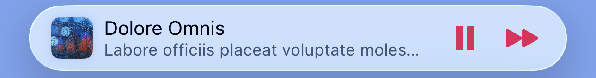
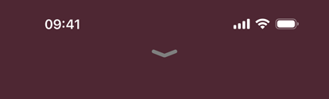
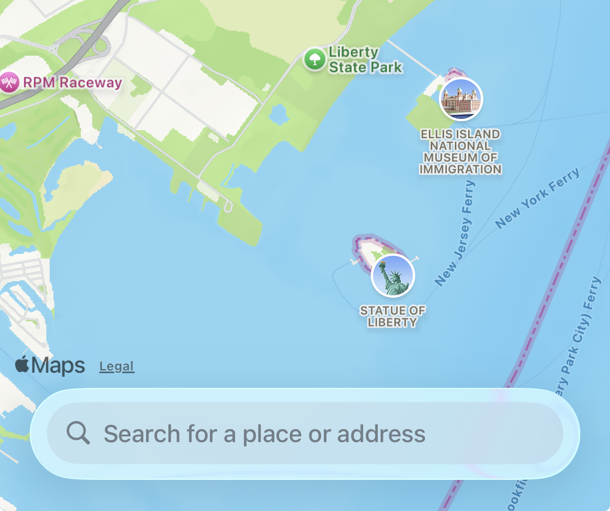

# LNPopupController

`LNPopupController` is a framework for presenting view controllers as popups of other view controllers, much like the Apple Music and Podcasts apps.

For SwiftUI, check out the [LNPopupUI library](https://github.com/LeoNatan/LNPopupUI).

[](https://github.com/LeoNatan/LNPopupController/releases) [](https://github.com/LeoNatan/LNPopupController/stargazers) [](https://raw.githubusercontent.com/LeoNatan/LNPopupController/master/LICENSE) <span class="badge-paypal"><a href="https://paypal.me/LeoNatan25" title="Donate to this project using PayPal"></a></span>

[](https://github.com/LeoNatan/LNPopupController/issues) [](https://github.com/LeoNatan/LNPopupController/graphs/contributors) [](https://swift.org/package-manager/) [](https://github.com/Carthage/Carthage)

<p align="center"></p>

Once a popup bar is presented with a content view controller, the user can swipe or tap the popup bar at any point to present the popup. After finishing, the user dismisses the popup by either swiping or tapping the popup close button.

The framework is intended to be very generic and work in most situations, so it is implemented as a category over `UIViewController`. Each view controller can present a popup bar, docked to a bottom view. 
For `UITabBarController` subclasses, the default docking view is the tab bar. 
For `UINavigationController` subclasses, the default docking view is the toolbar.
For other classes, the popup bar is presented at the bottom of the screen. View controller subclasses can provide their own docking views.

The framework correctly maintains the safe area insets of the container controller’s view and its child controllers, as the popup bar is presented and dismissed.

The information displayed on the popup bar is provided dynamically with popup item objects (instances of the `LNPopupItem` class) associated with the popup content view controllers. To change this information, update the popup item of the view controller.

Generally, it is recommended to present the popup bar on the outermost container controller. So if you have a view controller contained in a navigation controller, which is in turn contained in a tab bar controller, it is recommended to present the popup bar on the tab bar controller.

Check the demo project for many common use cases of the framework in various scenarios. It contains examples in Swift and Objective C.

### Features

* Available for iOS 13 and above, as an Xcode framework or an SPM package
* Good citizen in modern UIKit world
* Modern Objective C syntax and great Swift interoperability
* For SwiftUI, check out the [LNPopupUI library](https://github.com/LeoNatan/LNPopupUI).

## Adding to Your Project

### Swift Package Manager

Swift Package Manager is the recommended way to integrate `LNPopupController` in your project.

`LNPopupController` supports SPM versions 5.5 and above. To use SPM, you should use Xcode 13 to open your project. Click `File` -> `Swift Packages` -> `Add Package Dependency`, enter `https://github.com/LeoNatan/LNPopupController`. Select the version you’d like to use.

You can also manually add the package to your Package.swift file:

```swift
.package(url: "https://github.com/LeoNatan/LNPopupController.git", from: "2.15.0")
```

And the dependency in your target:

```swift
.target(name: "MyExampleApp", dependencies: ["LNPopupController"]),
```

### Carthage

Add the following to your Cartfile:

```github "LeoNatan/LNPopupController"```

Make sure you follow the Carthage integration instructions [here](https://github.com/Carthage/Carthage#if-youre-building-for-ios-tvos-or-watchos).

### Manual

Drag the `LNPopupController.xcodeproj` project to your project, and add `LNPopupController.framework` to **Embedded Binaries** in your project target's **General** tab. Xcode should sort everything else on its own.

### CocoaPods

CocoaPods is not supported. There are many reasons for this. Instead of CocoaPods, use Swift Package Manager from within Xcode. You can continue using CocoaPods for for your other dependencies and Swift Package Manager for `LNPopupController`.

## Using the Framework

### Swift

While the framework is written in Objective C, it uses modern Objective C syntax, so using the framework in Swift is very easy and intuitive.

### Project Integration

Import the module in your project:

```swift
import LNPopupController
```

### Popup Items

A popup item should always reflect the popup information about the view controller with which it is associated. The popup item should provide a title and subtitles to display in the popup bar, when the view controller is presented as a popup content controller. In addition, the item may contain additional buttons to display on the leading and/or trailing edges of the popup bar using `leadingBarButtonItems` and `trailingBarButtonItems`.

### Managing the Popup Bar

To present the popup bar, create a content controller, update its popup item and present the popup bar using `presentPopupBar(with:animated:completion:)`.

```swift
let demoVC = DemoPopupContentViewController()
demoVC.view.backgroundColor = .red
demoVC.popupItem.title = "Hello World"
demoVC.popupItem.subtitle = "And a subtitle!"
demoVC.popupItem.progress = 0.34
    
tabBarController?.presentPopupBar(with: demoVC, animated: true, completion: nil)
```

You can present a new content controller while the popup bar is presented and when the popup itself is open.

To open and close the popup programatically, use `openPopup(animated:completion:)` and `closePopup(animated:completion:)` respectively.

```swift
tabBarController?.openPopup(animated: true, completion: nil)
```

Alternatively, you can present the popup bar and open the popup in one animation, using `presentPopupBar(with:openPopup:animated:completion:)`.

```swift
tabBarController?.presentPopupBar(with: demoVC, openPopup:true, animated: true, completion: nil)
```

To dismiss the popup bar, use `dismissPopupBar(animated:completion:)`.

```swift
tabBarController?.dismissPopupBar(animated: true, completion: nil)
```

If the popup is open when dismissing the popup bar, the popup content will also be dismissed.

### Popup Container View Controllers

Any `UIViewController` subclasses can be popup container view controllers. The popup bar is attached to a bottom docking view. By default, `UITabBarController` and `UINavigationController` subclasses return their bottom bars as docking view, while other controllers return a hidden 0pt height view on the bottom of the view. In your subclass, override `bottomDockingViewForPopupBar` and `defaultFrameForBottomDockingView` and return your view and frame accordingly. **The returned view must be attached to the bottom of the view controller's view, or results are undefined.**

```swift
override var bottomDockingViewForPopupBar: UIView? {
  return myCoolBottomView
}

override var defaultFrameForBottomDockingView: CGRect {
  var bottomViewFrame = myCoolBottomView.frame
  
  if isMyCoolBottomViewHidden {
    bottomViewFrame.origin = CGPoint(x: bottomViewFrame.x, y: view.bounds.height)
  } else {
    bottomViewFrame.origin = CGPoint(x: bottomViewFrame.x, y: view.bounds.height - bottomViewFrame.height)
  }
  
  return bottomViewFrame
}
```

### Appearance and Behavior

`LNPopupController` provides three distinct styles of popup look and feel, each based on Music app looks and feels, that Apple has introduced over the years. Popup bar styles are labeled "floating”, “prominent" and "compact", matching the appropriate Apple style. Popup interaction styles are labeled "snap" for modern style snapping popups and "drag" for iOS 9 interactive popup interaction. Popup close buttons styles are labeled "chevron" for modern style chevron close button and "round" for iOS 9-style close buttons. For each, there is a "default" style for choosing the most suitable one for the current platform and operating system version.

The defaults are:

- iOS 17:

  * Floating bar style

  * Snap interaction style

  * Grabber close button style

  * No progress view style

- iOS 16 and below:

  - Prominent bar style

  * Snap interaction style

  * Chevron close button style

  * No progress view style

You can also present completely custom popup bars. For more information, see [Custom Popup Bars](#custom-popup-bars).

By default, for navigation and tab bar container controllers, the appearance of the popup bar is determined according to the bottom bar's appearance. For other container controllers, a default appearance is used, most suitable for the current environment.

<p align="center"></p>

To disable inheriting the bottom bar’s appearance, set the `inheritsAppearanceFromDockingView` property to `false`.

#### Bar Style

Customizing the popup bar style is achieved by setting the popup bar's `barStyle` property.

```swift
navigationController?.popupBar.barStyle = .compact
```

<p align="center">  </p>

#### Interaction Style

Customizing the popup interaction style is achieved by setting the popup presentation containing controller's `popupInteractionStyle` property.

```swift
navigationController?.popupInteractionStyle = .drag
```

<p align="center"> </p>

#### Progress View Style

Customizing the popup bar progress view style is achieved by setting the popup bar's `progressViewStyle` property.

```swift
navigationController?.popupBar.progressViewStyle = .top
```

To hide the progress view, set the `progressViewStyle` property to `LNPopupBar.ProgressViewStyle.none`.

<p align="center"><br/><br/><br/><br/></p>

#### Close Button Style

Customizing the popup close button style is achieved by setting the popup content view's `popupCloseButtonStyle` property.

```swift
navigationController.popupContentView.popupCloseButtonStyle = .round
```

To hide the popup close button, set the `popupCloseButtonStyle` property to `LNPopupCloseButton.Style.none`.

<p align="center"><br/><br/><br/><br/></p>

#### Text Marquee Scroll

Supplying long text for the title and/or subtitle will result in a scrolling text, if text marquee is enabled. Otherwise, the text will be truncated.

<p align="center"> </p>

#### Popup Bar Customization

`LNPopupBar` exposes many APIs to customize the default popup bar's appearance. Use `LNPopupBarAppearance` objects to define the standard appearance of the bar.

Remember to set the `inheritsAppearanceFromDockingView` property to `false`, or some of your customizations might be overridden by the bottom bar’s appearance.

```swift
let appearance = LNPopupBarAppearance()
appearance.titleTextAttributes = AttributeContainer()
    .font(UIFontMetrics(forTextStyle: .headline).scaledFont(for: UIFont(name: "Chalkduster", size: 14)!))
    .foregroundColor(UIColor.yellow)
appearance.subtitleTextAttributes = AttributeContainer()
    .font(UIFontMetrics(forTextStyle: .subheadline).scaledFont(for: UIFont(name: "Chalkduster", size: 12)!))
    .foregroundColor(UIColor.green)

let floatingBarBackgroundShadow = NSShadow()
floatingBarBackgroundShadow.shadowColor = UIColor.red
floatingBarBackgroundShadow.shadowOffset = .zero
floatingBarBackgroundShadow.shadowBlurRadius = 8.0
appearance.floatingBarBackgroundShadow = floatingBarBackgroundShadow

let imageShadow = NSShadow()
imageShadow.shadowColor = UIColor.yellow
imageShadow.shadowOffset = .zero
imageShadow.shadowBlurRadius = 3.0
appearance.imageShadow = imageShadow

if navigationController?.popupBar.barStyle == .floating {
    appearance.floatingBackgroundEffect = UIBlurEffect(style: .dark)
} else {
    appearance.backgroundEffect = UIBlurEffect(style: .dark)
    navigationController?.popupBar.inheritsAppearanceFromDockingView = false
}

navigationController?.popupBar.standardAppearance = appearance
navigationController?.popupBar.tintColor = .yellow
```

<p align="center">  </p>

#### System Interactions

The `hidesBottomBarWhenPushed` property is supported for navigation and tab bar controllers. When set to `true`, the popup bar will transition to the bottom of the pushed controller's view. Setting  `isToolbarHidden = true` and calling `setToolbarHidden(_:animated:)` are also supported.

<p align="center"> </p>

Status bar management of the popup content view controller is respected and applied when appropriate.

<p align="center"> </p>

Home indicator visibility control is respected and applied when appropriate.

Context menus are supported. Add a `UIContextMenuInteraction` interaction object to the popup bar, and it will behave as expected.

<p align="center"></p>

Pointer interactions are supported, and a default implementation is provided for system bar styles.

For custom popup bar controllers, the `LNPopupCustomBarViewController` class implements the `UIPointerInteractionDelegate` protocol. Implement the protocol's methods inside your subclass to implement custom pointer interactions.

<p align="center"></p>

Starting with iOS 15, scroll edge appearance is automatically disabled for toolbars and tab bars when a popup bar is presented, regardless of the scroll position of the content. Once the popup bar is dismissed, the scroll edge appearance is restored.

<p align="center"></p>

#### Custom Popup Bars

The framework supports implementing custom popup bars.

<p align="center"></p>

To implement a custom popup bar, you subclass `LNPopupCustomBarViewController`.

In your `LNPopupCustomBarViewController` subclass, build your popup bar's view hierarchy and set the controller's `preferredContentSize` property with the preferred popup bar height. Override any of the `wantsDefaultTapGestureRecognizer`, `wantsDefaultPanGestureRecognizer` and/or `wantsDefaultHighlightGestureRecognizer` properties to disable the default gesture recognizers functionality in your custom popup bar.

In your subclass, implement the `popupItemDidUpdate()` method to be notified of updates to the popup content view controller's item, or when a new popup content view controller is presented (with a new popup item). You must call the `super` implementation of this method.

Finally, set the `customBarViewController` property of the popup bar object to an instance of your `LNPopupCustomBarViewController` subclass. This will automatically change the bar style to `LNPopupBar.Style.custom`.

The included demo project includes two example custom popup bar scenes.

> [!TIP]
> Only implement a custom popup bar if you need a design that is significantly different than the provided [standard popup bar styles](#bar-style). A lot of care and effort has been put into integrating these popup bar styles with the UIKit system, including look, feel, transitions and interactions. Custom bars provide a blank canvas for you to implement a bar of your own, but if you end up recreating a bar design that is similar to a standard bar style, you are more than likely losing subtleties that have been added and perfected over the years in the standard implementations. Instead, consider using the [many customization APIs](#popup-bar-customization) to tweak the standard bar styles to fit your app’s design.

#### ProMotion Support

`LNPopupController` fully supports ProMotion on iPhone and iPad.

For iPhone 13 Pro and above, you need to add the `CADisableMinimumFrameDurationOnPhone` key to your Info.plist and set it to `true`. See [Optimizing ProMotion Refresh Rates for iPhone 13 Pro and iPad Pro](https://developer.apple.com/documentation/quartzcore/optimizing_promotion_refresh_rates_for_iphone_13_pro_and_ipad_pro?language=objc) for more information. `LNPopupController` will log a single warning message in the console if this key is missing, or is set to `false`.

#### Interaction Gesture Recognizer

`LNPopupContentView` exposes access to the popup interaction gesture recognizer in the way of the `popupInteractionGestureRecognizer` property. This gesture recognizer is shared for opening the popup, by swiping or panning the popup bar up (when the popup is closed), and closing the popup, by swiping or panning the popup content view down (when the popup bar is open).

When opening the popup, the system queries the `viewForPopupInteractionGestureRecognizer` property of the popup content view controller to determine which view to add the interaction gesture recognizer. By default, the property returns the content controller's root view. Override the property's getter to change this behavior.

The system attempts to cooperate as best it can with other gestures, including system gestures, controls and scrolling. When the user scrolls inside the popup content view hierarchy, the system will do its best not to interfere with the user’s gestures, and will only react when at the edge of scrolled content.

For vertically scrolling content, the popup will close only when the user swipes or drags past the scroll content’s edge.

For horizontal scrolling content, the popup will close only when user swipes or drags down and there there is no horizontal scroll.

For both multidirectional scrolling content, only `isDirectionalLockEnabled = true` is supported. In that case, the popup will close if both conditions above are met.

For multidirectional scroll content, the system will not attempt to close the popup at any point. The user can still close the popup by tapping the close button or swiping or dragging outside of the scrollable area.

You can implement the delegate of the interaction gesture recognizer in order to influence its behavior, such as preventing popup interaction when the user is interacting with other controls or views inside the popup content view hierarchy.

> [!CAUTION]
> If you disable the gesture recognizer after opening the popup, you must monitor the state of the popup and reenable the gesture recognizer once closed by the user or through code. Instead, consider implementing the gesture recognizer's delegate and providing custom logic to disable the interaction.

#### Full Right-to-Left Support

The framework has full right-to-left support.

<p align="center"> </p>

By default, the popup bar will follow the system's user interface layout direction, but will preserve the bar button items' order.
To customize this behavior, modify the popup bar's ```semanticContentAttribute``` and ```barItemsSemanticContentAttribute``` properties.

#### Accessibility

The framework supports accessibility and will honor accessibility labels, hints and values. By default, the accessibility label of the popup bar is the title and subtitle provided by the popup item.

<p align="center"></p>

To modify the accessibility label and hint of the popup bar, set the `accessibilityLabel` and `accessibilityHint` properties of the `LNPopupItem` object of the popup content view controller.

```swift
demoVC.popupItem.accessibilityLabel = NSLocalizedString("Custom popup bar accessibility label", comment: "")
demoVC.popupItem.accessibilityHint = NSLocalizedString("Custom popup bar accessibility hint", comment: "")
```

To add accessibility labels and hints to buttons, set the `accessibilityLabel` and `accessibilityHint` properties of the `UIBarButtonItem` objects.

```swift
let upNext = UIBarButtonItem(image: UIImage(named: "next"), style: .plain, target: self, action: #selector(nextItem))
upNext.accessibilityLabel = NSLocalizedString("Up Next", comment: "")
upNext.accessibilityHint = NSLocalizedString("Double tap to show up next list", comment: "")
```
To modify the accessibility label and hint of the popup close button, set the `accessibilityLabel` and `accessibilityHint` properties of the `LNPopupCloseButton` object of the popup container view controller.

```swift
tabBarController?.popupContentView.popupCloseButton.accessibilityLabel = NSLocalizedString("Custom popup close button accessibility label", comment: "")
tabBarController?.popupContentView.popupCloseButton.accessibilityHint = NSLocalizedString("Custom popup close button accessibility hint", comment: "")
```

To modify the accessibility label and value of the popup bar progress view, set the `accessibilityProgressLabel` and `accessibilityProgressValue` properties of the `LNPopupItem` object of the popup content view controller.

```swift
demoVC.popupItem.accessibilityImageLabel = NSLocalizedString("Custom image label", comment: "")
demoVC.popupItem.accessibilityProgressLabel = NSLocalizedString("Custom accessibility progress label", comment: "")
demoVC.popupItem.accessibilityProgressValue = "\(accessibilityDateComponentsFormatter.stringFromTimeInterval(NSTimeInterval(popupItem.progress) * totalTime)!) \(NSLocalizedString("of", comment: "")) \(accessibilityDateComponentsFormatter.stringFromTimeInterval(totalTime)!)"
```

## Notes

* Legacy non-translucent tab bar and toolbars are not supported and can cause visual artifacts or layout glitches. Apple has many problem with such bars, and supporting those is not a priority for `LNPopupController`.
  * The correct way to achieve an opaque bar is to use the `UIBarAppearance.configureWithOpaqueBackground()` API, which is supported by `LNPopupController`.
* Manually setting bottom bar properties, such as setting a tab bar’s or a toolbar’s `isHidden = true` **is explicitly discouraged by Apple and not supported by the framework**; it will lead to undefined behavior by the framework.

## Acknowledgements

The framework uses:
* [MarqueeLabel](https://github.com/cbpowell/MarqueeLabel) Copyright (c) 2011-2023 Charles Powell
* [smooth-gradient](https://github.com/janselv/smooth-gradient) Copyright (c) 2016 Jansel Valentin

Additionally, the demo project uses:

* [LoremIpsum](https://github.com/lukaskubanek/LoremIpsum) Copyright (c) 2013 Lukas Kubanek

## Star History

[](https://star-history.com/#LeoNatan/LNPopupController&Date)
