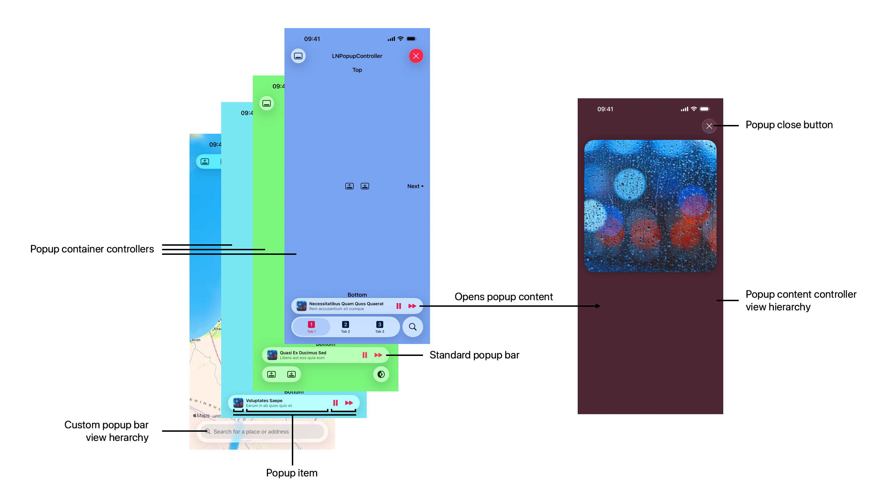
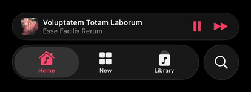
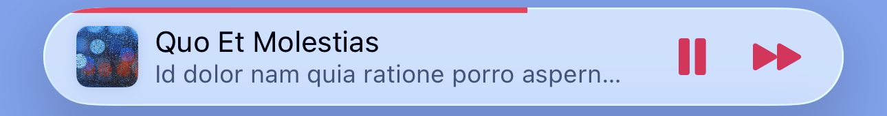
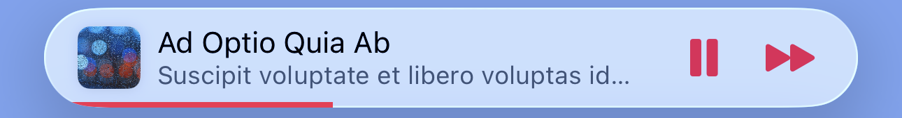
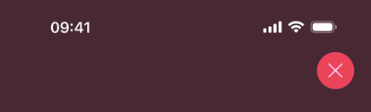
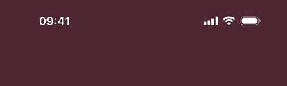
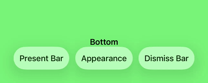
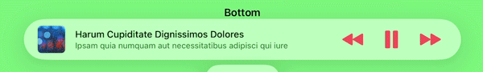

# LNPopupController

LNPopupController is a framework for presenting view controllers as popups of other view controllers, similar to the Apple Music and Podcasts mini-players.

For SwiftUI, check out the [LNPopupUI library](https://github.com/LeoNatan/LNPopupUI).

[](https://github.com/LeoNatan/LNPopupController/releases) [](https://github.com/LeoNatan/LNPopupController/stargazers) [](https://raw.githubusercontent.com/LeoNatan/LNPopupController/master/LICENSE) <span class="badge-paypal"><a href="https://paypal.me/LeoNatan25" title="Donate to this project using PayPal"></a></span>

[](https://github.com/LeoNatan/LNPopupController/issues) [](https://github.com/LeoNatan/LNPopupController/graphs/contributors) [](https://swift.org/package-manager/) [](https://github.com/Carthage/Carthage)

<p align="center"></p>

Once a popup bar is presented with a content view controller, the user can swipe or tap the popup bar present the popup, interact with the popup content and dismiss the popup by either swiping down or tapping the popup close button.

The framework is intended to be very generic and work in most situations, so it is implemented as a category over `UIViewController`. Each view controller can present a popup bar, docked to a bottom view. 
For `UITabBarController` and its subclasses, the default docking view is the tab bar. 
For `UINavigationController` and its subclasses, the default docking view is the toolbar.
For other view controllers, the popup bar is presented at the bottom of the screen. View controller subclasses can provide their own docking views.

The framework correctly maintains the safe area insets of the container controller’s view and its child controllers, as the popup bar is presented and dismissed.

The information displayed on the popup bar is provided dynamically with popup item objects (instances of the `LNPopupItem` class) associated with the popup content view controllers. To change this information, update the popup item of the view controller.

Generally, it is recommended to present the popup bar on the outermost container controller. So if you have a view controller contained in a navigation controller, which is in turn contained in a tab bar controller, it is recommended to present the popup bar on the tab bar controller.

Check the demo project for many common use cases of the framework in various scenarios. It contains examples in Swift and Objective C.

> [!TIP]
> To run the example project, don't forget to update submodules by running: `git submodule update --init --recursive`

### Features

* Supports iOS 26 glass design, while maintaining an appropriate look and feel on previous iOS versions
* Available for iOS 13 and later, as an SPM package for Swift and Objective C
* Good citizen in modern UIKit world
* For SwiftUI, check out the [LNPopupUI library](https://github.com/LeoNatan/LNPopupUI)

## Adding to Your Project and Using the Framework

### Swift Package Manager

`LNPopupController` supports SPM versions 6.0 (Xcode 16) and later. In Xcode, click `File` → `Add Package Dependencies…`, enter `https://github.com/LeoNatan/LNPopupController`. Select the version you’d like to use.

You can also manually add the package to your Package.swift file:

```swift
.package(url: "https://github.com/LeoNatan/LNPopupController.git", from: "4.0.0")
```

And the dependency in your target:

```swift
.target(name: "MyExampleApp", dependencies: ["LNPopupController"]),
```

Import the module in your source files:

```swift
import LNPopupController
```

## Managing a Popup Presentation

A popup presentation consists of the following concepts:

- **Popup container controller** —the `UIViewController` that hosts the popup presentation. Normally this is the outer-most tab bar or navigation controller, but can be any `UIViewController`, including a custom container with its own custom bottom bar.
- **Popup content controller**—a `UIViewController` that represents the content, when the popup is open.
- **Popup bar**—a bar, docked to the bottom of the container controller’s view, either above the container’s bottom bar or directly at the bottom of the screen, presenting at-a-glance information to the user and allows interaction by the user. Can be a default system popup bar style or a completely custom implementation.
- **Popup items**—the source of data that is displayed on the popup bar at any given time.
- **Custom popup bar controller**—optional, when presenting a custom popup bar

<picture>
  <source media="(prefers-color-scheme: dark)" srcset="./Supplements/overview-dark.png">
  <source media="(prefers-color-scheme: light)" srcset="./Supplements/overview.png">
  
</picture>

To start a popup presentation, there are two modes of operation that you can choose: the first, content controller as popup item source, is simpler and easier to implement, but does not allow popup item paging; the second, developer-provided popup item data source, is more robust, allows popup item paging, but requires more tought in how to route information in your app.

### Mode 1: Content Controllers as Popup Item Source (Default, Easier)

In this mode, your content controller is the source of the popup item to display on the popup bar. Create a content controller, update its popup item and present the bar using `presentPopupBar(with:animated:completion:)`.

```swift
class PopupContentViewController: UIViewController {
	init() {
		// ...
		
		popupItem.title = "Hello Title"
		popupItem.subtitle = "And a Subtitle!"
		popupItem.progress = 0.34
        popupItem.barButtonItems = [/* ... */]
	}
}

func presentPopupBar() {
	let contentVC = PopupContentViewController()
	tabBarController?.presentPopupBar(with: contentVC)
}
```

Each popup content controller manages its own popup item and is responsible to keep its information up to date. Updates to popup items are tracked, and the popup bar is automatically updated with the latest information. You can present a new content controller while the popup bar is presented or even when the popup itself is open; the popup bar will update its content with the new content controller's popup item and the content view will update with the new controller's view hierarchy.

### Mode 2: Popup Item Data Source (Advanced)

In this mode, you provide a data source to the popup bar, which can provide one or more popup items. This decouples the popup item from the content controller and allows for more advanced scenarios, such as popup item paging. You activate this mode by setting popup bar's `usesContentControllersAsDataSource` to `false`.

Before presenting a content controller, you must either provide an initial popup item or set the popup bar's data source, and implement `initialPopupItem(for:)` optional method. The system will use this popup item for popup bar presentation. Updates to popup items are tracked, and the popup bar is automatically updated with the latest information.

At any point, you can set the popup bar's `popupItem` with a new popup item. Whenever a popup bar's popup item changes, the `UIViewController.popupItemDidChange(_:)` method is called to let the content controller know its popup item has changed.

```swift
class PopupContentViewController: UIViewController {
	init() {
		// ...
	}
	
	override func popupItemDidChange(_ previousPopupItem: LNPopupItem?) {
		// Handle updating the content view hierarchy with the new popup item
	}
}

func presentPopupBar() {
	tabBarController?.popupBar.usesContentControllersAsDataSource = false
	
	let initialPopupItem = LNPopupItem()
	initialPopupItem.title = "Hello Title"
	initialPopupItem.subtitle = "And a Subtitle!"
	initialPopupItem.progress = 0.34
	initialPopupItem.barButtonItems = [/* ... */]
	
	tabBarController?.popupBar.popupItem = initialPopupItem
	
	let contentVC = PopupContentViewController()
	tabBarController?.presentPopupBar(with: contentVC)
}
```

#### Popup Item Paging

When implemented, the popup bar allows the user to page between different popup items through swiping on the title views.

<p align="center"></p>

To implement, you must set the popup bar's data source, and in it, implement **both** `popupBar(_:popupItemBefore:)` and `popupBar(_:popupItemAfter:)`. Optionally, you can also set a popup bar delegate and implement `popupBar(_:didDisplay:previous:)` to be notified when a new popup item is displayed (in addition to the popup content controller's `UIViewController.popupItemDidChange(_:)` call).

```swift
func presentPopupBar() {
	// ...
	tabBarController?.popupBar.dataSource = self.model
	tabBarController?.popupBar.delegate = self
	// ...
}

// MARK: LNPopupDataSource

func popupBar(_ popupBar: LNPopupBar, popupItemBefore popupItem: LNPopupItem) -> LNPopupItem? {
	// Return a popop item representing the content before `popupItem` or `nil`
}

func popupBar(_ popupBar: LNPopupBar, popupItemAfter popupItem: LNPopupItem) -> LNPopupItem? {
	// Return a popop item representing the content after `popupItem` or `nil`
}

// MARK: LNPopupDelegate
	
func popupBar(_ popupBar: LNPopupBar, didDisplay newPopupItem: LNPopupItem, previous previousPopupItem: LNPopupItem?) {
	// Called when the popup bar's popup item changes (in addition to the content controller's `UIViewController.popupItemDidChange(_:)` call)
}
```

> [!TIP]
> In this mode, carefully consider how you route data between the different components of your app. The framework provides as much information as possible to trigger updates in your content as a response to programatic and user changes to popup items.

### Popup Items

Regardless of which mode you have chosen, a popup item always reflects the popup bar information of the popup presentation. The popup item can provide an image, a title and a subtitle, bar buttons and more. Updates to popup items are tracked, and the popup bar is automatically updated with the latest information.

### Programatic Popup Control

To open and close the popup programatically, use `openPopup(animated:completion:)` and `closePopup(animated:completion:)` respectively.

```swift
tabBarController?.openPopup()
```

Alternatively, you can present the popup bar and open the popup in one animation using `presentPopupBar(with:openPopup:animated:completion:)`.

```swift
tabBarController?.presentPopupBar(with: contentVC, openPopup:true)
```

To dismiss the popup bar, use `dismissPopupBar(animated:completion:)`.

```swift
tabBarController?.dismissPopupBar()
```

If the popup is open when dismissing the popup bar, the popup will also be closed.

## Appearance and Behavior

`LNPopupController` provides many different properties to present users with popup bars, open popups and let the user interact with them. By default, the framework chooses styles to match the user’s current operating system version, but can all be customized as required.

<p align="center"></p>

The defaults are:

- iOS 26:

  - Floating compact bar style
  - Snap interaction style
  - Grabber close button style

- iOS 17-18:

  - Floating bar style
  - Snap interaction style
  - Grabber close button style

- iOS 16 and below:

  - Prominent bar style
  - Snap interaction style
  - Chevron close button style

> [!NOTE]
> On iOS 26 and later, `UIDesignRequiresCompatibility` is supported, and the framework will use legacy styles and appearance when the key is present in your app’s Info.plist and is set to `YES`.

You can also present completely custom popup bars. For more information, see [Custom Popup Bars](#custom-popup-bars).

By default, for navigation and tab bar container controllers, the popup bar inherits its appearance from the bottom bar. For other container controllers, a default appearance is used, most suitable for the current environment.

To disable inheriting the bottom bar’s appearance, set the `inheritsAppearanceFromDockingView` property to `false`.

### Bar Style

Customizing the popup bar style is achieved by setting the popup bar's `barStyle` property.

Starting with iOS 26, the framework supports primarily a floating and a compact floating popup bar.

```swift
navigationController?.popupBar.barStyle = .floating
```

###### Floating Compact:

<p align="center"></p>

###### Floating:

<p align="center"></p>

#### Legacy Bar Styles

On iOS 18 and below, the framework presents popup bar styles and animations that are appropriate for the user's operating system. Non-floating prominent and compact bar styles are also available.

###### Floating:
<p align="center">

###### Prominent:
<p align="center"></p>

###### Compact:
<p align="center"></p>

> [!NOTE]
> On iOS 26 and later, non-floating bar styles will be automatically converted to the appropriate floating style.

### Interaction Style

Customizing the popup interaction style is achieved by setting the popup presentation containing controller's `popupInteractionStyle` property.

```swift
navigationController?.popupInteractionStyle = .drag
```

<p align="center"> </p>

### Progress View Style

Customizing the popup bar progress view style is achieved by setting the popup bar's `progressViewStyle` property.

```swift
navigationController?.popupBar.progressViewStyle = .top
```

By default, progress view is hidden.

<p align="center"><br/><br/><br/><br/></p>

### Close Button Style

Customizing the popup close button style is achieved by setting the popup content view's `popupCloseButtonStyle` property.

```swift
navigationController.popupContentView.popupCloseButtonStyle = .prominentGlass
```

To hide the popup close button, set the `popupCloseButtonStyle` property to `LNPopupCloseButton.Style.none`.

<p align="center"><br/><br/> <br/><br/> </p>

Positioning of the popup close button—leading, center or trailing, is controlled through the `popupCloseButtonPositioning` property.

### Text Marquee Scroll

Supplying long text for the title and/or subtitle will result in a scrolling text, if text marquee is enabled. Otherwise, the text will be truncated.

<p align="center"> </p>

### Popup Transitions

The framework supports popup image transitions:

<p align="center"></p>

Transitions are opt-in and require you either use an `LNPopupImageView` image view in your popup content, which is discovered automatically by the system, or provide a view that will serve as the transition target/source by implementing `viewForPopupTransition(from:to:)` in popup content controller.

For optimal results, use an `LNPopupImageView` instance in your popup content view hierarchy, that displays the same image displayed in the popup bar's image view. By default, the system discovers the `LNPopupImageView` instance  automatically, and will use that as the transition target/source. The system will smoothly transition between the popup bar's image view and the `LNPopupImageView` instance, taking into account the corner radii and shadow of the view.

> [!TIP]
> When relying on automatic discovery, there must only be a single `LNPopupImageView` instance in your popup content controller's view hierarchy, or results will be undefined. For more advanced scenarios where automatic discovery fails, implement `viewForPopupTransition(from:to:)` in your content controller to return the correct instance.

You can return any custom view in `viewForPopupTransition(from:to:)` to serve as the transition target/source. The system will attempt to match the attributes of the provided view and the popup bar's image view as closely as possible to transition smoothly between them. Implement the `LNPopupTransitionView` protocol in your custom view to allow the system to smoothly transition between your custom view and the popup bar image view.

> [!CAUTION]
> Views returned from `viewForPopupTransition(from:to:)` must be part of the content controller's view hierarchy, or they will be ignored by the system and no transition will take place.

Transitions are only available for prominent and floating popup bar styles with drag interaction style. Any other combination will result in no transition and this method will not be called by the system.

#### Popup Bar Customization

`LNPopupBar` exposes many APIs to customize the popup bar's appearance. Use `LNPopupBarAppearance` objects to define the standard appearance of the bar.

Remember to set the `inheritsAppearanceFromDockingView` property to `false`, or some of your customizations might be overridden by inheriting the bottom bar’s appearance.

```swift
let appearance = LNPopupBarAppearance()
appearance.titleTextAttributes = AttributeContainer()
    .font(UIFontMetrics(forTextStyle: .headline).scaledFont(for: UIFont(name: "Chalkduster", size: 14)!))
    .foregroundColor(UIColor.yellow)
appearance.subtitleTextAttributes = AttributeContainer()
    .font(UIFontMetrics(forTextStyle: .subheadline).scaledFont(for: UIFont(name: "Chalkduster", size: 12)!))
    .foregroundColor(UIColor.green)

let floatingBarBackgroundShadow = NSShadow()
floatingBarBackgroundShadow.shadowColor = UIColor.red
floatingBarBackgroundShadow.shadowOffset = .zero
floatingBarBackgroundShadow.shadowBlurRadius = 8.0
appearance.floatingBarBackgroundShadow = floatingBarBackgroundShadow

let imageShadow = NSShadow()
imageShadow.shadowColor = UIColor.yellow
imageShadow.shadowOffset = .zero
imageShadow.shadowBlurRadius = 3.0
appearance.imageShadow = imageShadow

appearance.floatingBackgroundEffect = UIBlurEffect(style: .dark)

navigationController?.popupBar.standardAppearance = appearance
navigationController?.popupBar.tintColor = .yellow
```

<p align="center"></p>

### System Interactions

#### Popup Bar Minimization

The framework supports popup bar minimization starting with iOS 26. Currently, it is supported with `UITabBarController` container controllers.

<p align="center"></p>

To enable, set the minimization mode of the tab bar controller:

```swift
self.tabBarController?.tabBarMinimizeBehavior = .onScrollDown
```

To listen to bar environment changes in your popup content controller and update the popup item accordingly, register for the `LNPopupBar.EnvironmentTrait` trait changes:

```swift
registerForTraitChanges([LNPopupBar.EnvironmentTrait.self]) { (self: Self, previousTraitCollection) in
    self.popupItem.barButtonItems?.last?.isHidden = self.traitCollection.popupBarEnvironment == .inline
}
```

You can also handle changes in `traitCollectionDidChange(_:)`.

> [!TIP]
> When handling environment trait changes, for optimal transition animation, it is preferred to set bar button items as visible/hidden instead of adding and removing button objects.

Popup bar minimization is enabled by default, and is supported for system and custom popup bars, with the exception of custom bars with `LNPopupBar.customBarWantsFullBarWidth = true`. To disable popup bar minimization, set `LNPopupBar.supportsMinimization` to `false`.

#### Bar Transitions

The `hidesBottomBarWhenPushed` property is supported for navigation and tab bar controllers. When set to `true`, the popup bar will transition to the bottom of the pushed controller's view. Setting  `isToolbarHidden = true` or `isTabBarHidden = true` and calling `setToolbarHidden(_:animated:)` or `setTabBarHidden:(_:animated:)` are also supported.

<p align="center"> </p>

#### Tab Bar Sidebar

Starting with iPadOS 18, the framework supports `UITabBarController` sidebars. When the sidebar displaces the underlying content, the popup bar moves out of the way.

<p align="center"></p>

When the sidebar overlays the underlying content, the popup bar dims together with the content:

<p align="center"></p>

#### Status Bar Management

Status bar management of the popup content view controller is respected and applied when appropriate.

<p align="center"> </p>

Home indicator visibility control is respected and applied when appropriate.

#### Context Menu Interactions

Context menus are supported. Add a `UIContextMenuInteraction` interaction object to the popup bar, and it will behave as expected.

<p align="center"></p>

#### Pointer Interactions

Pointer interactions are supported, and a default implementation is provided for system bar styles.

For custom popup bar controllers, the `LNPopupCustomBarViewController` class implements the `UIPointerInteractionDelegate` protocol. Implement the protocol's methods inside your subclass to implement custom pointer interactions.

<p align="center"></p>

#### Scroll-edge Appearance

With iOS versions 15 up to 18, scroll-edge appearance is automatically disabled for toolbars and tab bars when a popup bar is presented, regardless of the scroll position of the content. Once the popup bar is dismissed, the scroll-edge appearance is restored.

On iOS 26 and later, this is no longer necessary.

<p align="center"></p>

#### Interaction Gesture Recognizer

`LNPopupContentView` exposes access to the popup interaction gesture recognizer in the way of the `popupInteractionGestureRecognizer` property. This gesture recognizer is shared for opening the popup, by swiping or panning the popup bar up (when the popup is closed), and closing the popup, by swiping or panning the popup content view down (when the popup bar is open).

When opening the popup, the system queries the `viewForPopupInteractionGestureRecognizer` property of the popup content view controller to determine which view to add the interaction gesture recognizer. By default, the property returns the content controller's root view. Override the property's getter to change this behavior.

The system attempts to cooperate as best it can with other gestures, including system gestures, controls and scrolling. When the user scrolls inside the popup content view hierarchy, the system will do its best not to interfere with the user’s gestures, and will only react when at the edge of scrolled content.

For vertically scrolling content, the popup will close only when the user swipes or drags past the scroll content’s edge.

For horizontal scrolling content, the popup will close only when user swipes or drags down and there there is no horizontal scroll.

For both multidirectional scrolling content, only `isDirectionalLockEnabled = true` is supported. In that case, the popup will close if both conditions above are met.

For multidirectional scroll content, the system will not attempt to close the popup at any point. The user can still close the popup by tapping the close button or swiping or dragging outside of the scrollable area.

You can implement the delegate of the interaction gesture recognizer in order to influence its behavior, such as preventing popup interaction when the user is interacting with other controls or views inside the popup content view hierarchy.

> [!CAUTION]
> If you disable the gesture recognizer after opening the popup, you must monitor the state of the popup and reenable the gesture recognizer once closed by the user or through code. Instead, consider either implementing `viewForPopupInteractionGestureRecognizer` and return an appropriate view, or set the gesture recognizer's delegate and provide custom logic to disable interactions when required.

### Custom Popup Bars

The framework supports implementing custom popup bars:

<p align="center"></p>

To implement a custom popup bar, you subclass `LNPopupCustomBarViewController`.

In your `LNPopupCustomBarViewController` subclass, build your popup bar's view hierarchy and set the controller's `preferredContentSize` property with the preferred popup bar height. Override any of the `wantsDefaultTapGestureRecognizer`, `wantsDefaultPanGestureRecognizer` and/or `wantsDefaultHighlightGestureRecognizer` properties to disable the default gesture recognizers functionality in your custom popup bar.

In your subclass, implement the `popupItemDidUpdate()` method to be notified of updates to the popup content view controller's item, or when a new popup content view controller is presented (with a new popup item). You must call the `super` implementation of this method.

Finally, set the `customBarViewController` property of the popup bar object to an instance of your `LNPopupCustomBarViewController` subclass. This will automatically change the bar style to `LNPopupBar.Style.custom`.

The included demo project includes two example custom popup bar scenes.

> [!TIP]
> Only implement a custom popup bar if you need a design that is significantly different than the provided [standard popup bar styles](#bar-style). A lot of care and effort has been put into integrating these popup bar styles with the UIKit system, including look, feel, transitions and interactions. Custom bars provide a blank canvas for you to implement a bar of your own, but if you end up recreating a bar design that is similar to a standard bar style, you are more than likely losing subtleties that have been added and perfected over the years in the standard implementations. Instead, consider using the [many customization APIs](#popup-bar-customization) to tweak the standard bar styles to fit your app’s design.

### ProMotion Support

`LNPopupController` fully supports ProMotion on iPhone and iPad.

For iPhone 13 Pro and later, you need to add the `CADisableMinimumFrameDurationOnPhone` key to your Info.plist and set it to `true`. See [Optimizing ProMotion Refresh Rates for iPhone 13 Pro and iPad Pro](https://developer.apple.com/documentation/quartzcore/optimizing_promotion_refresh_rates_for_iphone_13_pro_and_ipad_pro?language=objc) for more information. `LNPopupController` will log a single warning message in the console if this key is missing, or is set to `false`.

### Full Right-to-Left Support

The framework has full right-to-left support.

<p align="center"> </p>

By default, the popup bar will follow the system's user interface layout direction, but will preserve the bar button items' order.
To customize this behavior, modify the popup bar's ```semanticContentAttribute``` and ```barItemsSemanticContentAttribute``` properties.

### Accessibility

The framework supports accessibility and will honor accessibility labels, traits, hints and values. By default, the accessibility label of the popup bar is the title and subtitle provided by the popup item.

<p align="center"></p>

To modify the accessibility label and hint of the popup bar, set the `accessibilityLabel` and `accessibilityHint` properties of the `LNPopupItem` object of the popup content view controller.

```swift
demoVC.popupItem.accessibilityLabel = NSLocalizedString("Custom popup bar accessibility label", comment: "")
demoVC.popupItem.accessibilityHint = NSLocalizedString("Custom popup bar accessibility hint", comment: "")
```

To add accessibility labels and hints to buttons, set the `accessibilityLabel` and `accessibilityHint` properties of the `UIBarButtonItem` objects.

```swift
let upNext = UIBarButtonItem(image: UIImage(named: "next"), style: .plain, target: self, action: #selector(nextItem))
upNext.accessibilityLabel = NSLocalizedString("Up Next", comment: "")
upNext.accessibilityHint = NSLocalizedString("Double tap to show up next list", comment: "")
```
To modify the accessibility label and hint of the popup close button, set the `accessibilityLabel` and `accessibilityHint` properties of the `LNPopupCloseButton` object of the popup container view controller.

```swift
tabBarController?.popupContentView.popupCloseButton.accessibilityLabel = NSLocalizedString("Custom popup close button accessibility label", comment: "")
tabBarController?.popupContentView.popupCloseButton.accessibilityHint = NSLocalizedString("Custom popup close button accessibility hint", comment: "")
```

To modify the accessibility label and value of the popup bar progress view, set the `accessibilityProgressLabel` and `accessibilityProgressValue` properties of the `LNPopupItem` object of the popup content view controller.

```swift
demoVC.popupItem.accessibilityImageLabel = NSLocalizedString("Custom image label", comment: "")
demoVC.popupItem.accessibilityProgressLabel = NSLocalizedString("Custom accessibility progress label", comment: "")
demoVC.popupItem.accessibilityProgressValue = "\(accessibilityDateComponentsFormatter.stringFromTimeInterval(NSTimeInterval(popupItem.progress) * totalTime)!) \(NSLocalizedString("of", comment: "")) \(accessibilityDateComponentsFormatter.stringFromTimeInterval(totalTime)!)"
```

### Custom Popup Container View Controllers

Any `UIViewController` can be a popup container view controller. The popup bar can be attached to either the bottom of the screen or above a bottom docking view. By default, popup bars presented on `UITabBarController` and `UINavigationController` subclasses are attached to their respective system bottom bars as docking views, while on all other controllers, the popup bar is attached to the bottom of the screen. 

If you have a custom container controller, such as a custom tab bar controller, you can override the `bottomDockingViewForPopupBar` property to return your designated bottom docking view, and `defaultFrameForBottomDockingView` to return the expected frame of the docking view. When presented, the popup bar will appear above the designated bottom docking view. If the container controller needs to reposition the bottom docking view, trigger a layout pass so the popup bar can take the new frame into account.

If you return `nil` from `bottomDockingViewForPopupBar`, the popup bar will be positioned at the bottom of the screen, or above the appropriate system bottom bar, such as a tab bar or a toolbar.

If your custom container controller supports hiding the designated bottom docking view, implement `isBottomDockingViewForPopupBarHidden` and return the correct value. To trigger a popup bar update, trigger a layout pass for your container controller's view. If the bottom docking view is hidden, the popup bar will be positioned at the bottom of the screen.

You can control the margin between the popup bar and the bottom docking view by implementing `bottomDockingViewMarginForPopupBar`.

###### Indirect Safe Area Management

If your bottom docking view is dependent on the safe area of your custom container controller, you might not want to have that be modified by the presentation of the popup bar. In such a case, implement the `requiresIndirectSafeAreaManagement` property to return `true`. The system will then modify the child controller's safe areas instead of modifying the container controller's safe area.

#### Example Implementation

```swift
class MyCustomTabBarController: UITabBarController {
	override var bottomDockingViewForPopupBar: UIView? {
		return myCustomTabBar
	}
	
	override var defaultFrameForBottomDockingView: CGRect {
		myCustomTabBar.frame
	}
	
	override var isBottomDockingViewForPopupBarHidden: Bool {
		!isMyCustomTabBarVisible
	}
	
	override var bottomDockingViewMarginForPopupBar: CGFloat {
		8.0
	}
	
	func toggleMyCustomTabBarVisible() {
		UIView.animate(withDuration: 0.4, 
                       delay: 0.0, 
                       usingSpringWithDamping: 1.0, 
                       initialSpringVelocity: 0.0) {
			self.isMyCustomTabBarVisible.toggle()
			
			// Animate your bar position here according to isMyCustomTabBarVisible.
            self.updateMyCustomTabBarConstraints()
			
			// Trigger a layout pass so that the popup bar animates to the correct position
			self.view.layoutIfNeeded()
		}
	}
}
```

The example project includes a fully functional example scene with a custom tab bar container controller, including animated and/or interactive custom tab bar hiding support.

## Additional Notes

* Legacy non-translucent tab bar and toolbars are not supported and can cause visual artifacts or layout glitches. Apple has many problem with such bars, and supporting those is not a priority for `LNPopupController`.
  * The correct way to achieve an opaque bar is to use the `UIBarAppearance.configureWithOpaqueBackground()` API, which is supported by `LNPopupController`.
* Manually setting bottom bar properties, such as setting a tab bar’s or a toolbar’s `isHidden = true` **is explicitly discouraged by Apple and not supported by the framework**; it will lead to undefined behavior by the framework.
  * `UINavigationController.setToolbarHidden(_:animated:)` and `UITabBarController.setTabBarHidden(_:animated:)` are fully supported

## Acknowledgements

The framework uses:
* [MarqueeLabel](https://github.com/cbpowell/MarqueeLabel) Copyright (c) 2011-2023 Charles Powell
* [smooth-gradient](https://github.com/janselv/smooth-gradient) Copyright (c) 2016 Jansel Valentin

Additionally, the demo project uses:

* [LoremIpsum](https://github.com/lukaskubanek/LoremIpsum) Copyright (c) 2013 Lukas Kubanek

## Star History

<a href="https://www.star-history.com/#LeoNatan/LNPopupController&type=date&legend=top-left">
 <picture>
   <source media="(prefers-color-scheme: dark)" srcset="https://api.star-history.com/svg?repos=LeoNatan/LNPopupController&type=date&theme=dark&legend=top-left" />
   <source media="(prefers-color-scheme: light)" srcset="https://api.star-history.com/svg?repos=LeoNatan/LNPopupController&type=date&legend=top-left" />
   
 </picture>
</a>
