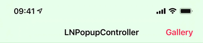

#LNPopupController

 

`LNPopupController` is a framework for presenting view controllers as popups of other view controllers, much like the Apple Music and Podcasts apps.

See a video [here](https://vimeo.com/137020302).

Once a popup bar is presented with a content view controller, the user can swipe or tap the popup at any point to present the content controller. After finishing, the user dismisses the popup by either swiping or tapping the Dismiss button.

The framework is intended to be very generic and work in most situations, so it was implemented as a category over `UIViewController`. Each view controller can present a popup bar, docked to a bottom view. 
For `UITabBarController` subclasses, the default dock view is the tab bar. 
For `UINavigationController` subclasses, the default dock view is the toolbar.
For other classes, the popup bar is presented at the bottom of the screen. Subclasses can provide their own docking view.

The framework will attempt to correct the bottom layout guide of the container controller and its child controllers as the popup bar is presented and dismissed.

The contents of the popup bar is built dynamically using the popup item objects (instances of the `LNPopupItem` class) associated with the popup content view controllers. To change the contents of the popup bar, you must therefore configure the popup items of your view controllers.

Generally, it is recommended to present the popup bar on the outermost container controller. So if you have a view controller container in a navigation controller, which is in turn contained in a tab bar controller, it is recommended to present the popup bar on the tab bar controller.

Check the demo projects for how to use the framework in various scenarios. It contains example in Swift and Objective C. **The demo project is only available for Xcode 7 and above, due to use of modern Swift syntax and Storyboard features. The framework is available for Xcode 6 as well. **

###Features

* Available for iOS 8 and above<sup>1</sup>, available as Xcode dynamic framework
* Good citizen in modern UIKit world
* Modern Objective C syntax for better Swift interoperability

<sup>1</sup> The framework is available for iOS 8 and above. **The included demo project has a deployment target of iOS 9 and above**, and may crash with certain features enabled on iOS 8 simulator or devices.

##Adding to Your Project

Drag the `LNPopupController.xcodeproj` project to your project, and add `LNNotificationsUI.framework` **Embedded Binaries** in your project target's **General** tab. Xcode should sort everything else on its own.

##Using the Framework

###Swift

While the framework is written in Objective C, it uses modern Objective C syntax, so using the framework in Swift should be very easy and intuitive.

###Project Integration

Import the module in your project:

```objective-c
@import LNPopupController;
```

Alternatively, you can import the umbrella header:

```objective-c
#import <LNPopupController/LNPopupController.h>
```

###Popup Items

A popup item always reflects information about the view controller with which it is associated. The popup item should provide a title and subtitles to display when the view controller is the content controller of a popup bar. In addition, the item may contain additional buttons to display on the left and right side of the popup bar using `leftBarButtonItems` and `rightBarButtonItems`.

###Managing the Popup Bar

To present the popup bar, create a content controller, update its popup item and present the popup bar.

```objective-c
DemoPopupContentViewController* demoVC = [DemoPopupContentViewController new];
demoVC.view.backgroundColor = [UIColor redColor];
demoVC.popupItem.title = @"Hello World";
demoVC.popupItem.subtitle = @"And a subtitle!";
demoVC.popupItem.progress = 0.34;
	
[self.tabBarController presentPopupBarWithContentViewController:demoVC animated:YES completion:nil];
```

You can present a new content controller while the popup bar is presented and when the popup itself is open.

To open and close the popup programatically, use `openPopupAnimated:completion:` and `closePopupAnimated:completion:` respectively.

```objective-c
[self.tabBarController openPopupAnimated:YES completion:nil];
```

Alternatively, you can present the popup bar and open the popup in one animation, using `presentPopupBarWithContentViewController:openPopup:animated:completion:`.

```objective-c
[self.tabBarController presentPopupBarWithContentViewController:demoVC openPopup:YES animated:YES completion:nil];
```

To dismiss the popup bar, use `dismissPopupBarAnimated:completion:`.

```objective-c
[self.tabBarController dismissPopupBarAnimated:YES completion:nil];
```

If the popup is open when dismissing the popup bar, the popup content will also be dismissed.

###Popup Container View Controllers

Any `UIViewController` subclasses can be popup container view controllers. The popup bar is attached to a bottom docking view. By default, `UITabBarController` and `UINavigationController` subclasses return their bottom bars as docking view, while other controllers return a hidden 0pt height view on the bottom of the view. In your subclass, override `bottomDockingViewForPopup` and `defaultFrameForBottomDockingView` and return your view and frame accordingly. **The returned view must be attached to the bottom of the view controller's view, or results are undefined.**

```objective-c
- (nonnull UIView *)bottomDockingViewForPopup
{
	return self.myCoolBottomView;
}

- (CGRect)defaultFrameForBottomDockingView
{
	CGRect bottomViewFrame = self.myCoolBottomView.frame;
	
	if(self.isMyCoolBottomViewHidden)
	{
		bottomViewFrame.origin = CGPointMake(bottomViewFrame.origin.x, self.view.bounds.size.height);
	}
	else
	{
		bottomViewFrame.origin = CGPointMake(bottomViewFrame.origin.x, self.view.bounds.size.height - bottomViewFrame.size.height);
	}
	
	return bottomViewFrame;
}
``` 

###Popup Bar Appearance and Behavior

For navigation and tab bar controller popup containers, the style of the popup bar is determined according to the bottom bar's appearance. For other container controllers, the style is the default style. For each style, title and button colors will be adjusted accordingly.

To update the popup bar appearance after updating the appearance of the bottom bar of the container controller, use the `updatePopupBarAppearance` method.


Supplying long text for the title and/or subtitle will result in a scrolling text. Otherwise, the text will be centered.


The `hidesBottomBarWhenPushed` property is supported for navigation and tab bar controllers. When set, the popup bar will transition out together with the bottom bar of the container controller. **Opening the popup while it is hidden due to `hidesBottomBarWhenPushed` is not supported and may produce undefined behavior.**

 

Status bar management of the popup content view controller is respected and applied when appropriate.

 

###Customization

Customization can be achieved through the ```LNPopupBar``` and ```LNPopupContentView``` classes.

```LNPopupBar``` exposes API to customize the popup bar's appearance, either directly or through `UIAppearance` API.

```objective-c
[[LNPopupBar appearanceWhenContainedInInstancesOfClasses:@[[UINavigationController class]]] setTitleTextAttributes:@{NSFontAttributeName: [UIFont fontWithName:@"Chalkduster" size:14], NSForegroundColorAttributeName: [UIColor yellowColor]}];
[[LNPopupBar appearanceWhenContainedInInstancesOfClasses:@[[UINavigationController class]]] setSubtitleTextAttributes:@{NSFontAttributeName: [UIFont fontWithName:@"Chalkduster" size:12], NSForegroundColorAttributeName: [UIColor greenColor]}];
[[LNPopupBar appearanceWhenContainedInInstancesOfClasses:@[[UINavigationController class]]] setBarStyle:UIBarStyleBlack];
[[LNPopupBar appearanceWhenContainedInInstancesOfClasses:@[[UINavigationController class]]] setTintColor:[UIColor yellowColor]];
```


```LNPopupContentView``` gives access to the popup close button and the popup interaction gesture recognizer.

**Note:** Be careful with modifying the popup interaction gesture recognizer. It is shared for interactively opening the popup by panning the popup bar (when it is closed), or interactively closing the popup interactively by panning the popup content view (when the popup is open). If you disable the gesture recognizer after opening the popup, you must monitor the state of the popup and reenable the gesture recognizer once closed by the user or through code.

##Known Limitations

* Navigation controller's `setToolbarHidden:` and `setToolbarHidden:animated:` are not supported

##Acknowledgements

The framework uses:
* [MarqueeLabel](https://github.com/cbpowell/MarqueeLabel) Copyright (c) 2011-2015 Charles Powell

Additionally, the demo project uses:

* [LoremIpsum](https://github.com/lukaskubanek/LoremIpsum) Copyright (c) 2013 Lukas Kubanek
* [COSTouchVisualizer](https://github.com/conopsys/COSTouchVisualizer) Copyright (c) 2014 Joe Blau
